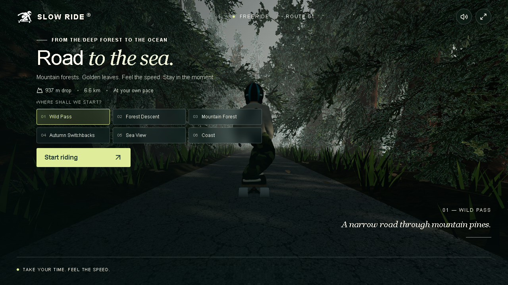

# slow-ride-coastal-descent — offline mirror



Offline mirror of **Slow Ride — Coastal Descent**: a scenic 3D snowboard/ski
descent game. You pick a course section (Wild Pass, Forest Descent, Deep in the
Forest, Golden Switchbacks…), carve down a procedurally-shaped coastal
mountain, and finish with a km-traveled summary. three.js rendering on a
vinext (Vite-style Next) build.

Source: https://slow-ride-coastal-descent.madasket.chatgpt.site/

## Layout

```
slow-ride-coastal-descent/
├── index.html                  — original served page
├── menu.mp3 / soundtrack.mp3   — game audio (referenced at runtime)
├── assets/                     — images and static media
├── _next/
│   ├── static/chunks/
│   │   ├── engine-Bi6T8dqO.js        — three.js + the app's engine tail (served)
│   │   ├── engine-Bi6T8dqO.pretty.js — prettified (readable)
│   │   ├── physics-BmpKl8k3.js/.pretty.js — course + terrain + rider physics
│   │   ├── page-Cxv21zlf.js/.pretty.js    — framework runtime + ride page UI
│   │   ├── index-BOaQCWj4.js/.pretty.js   — vinext client runtime (vendor)
│   │   └── framework-D_rUT4EX.js     — React (vendor)
│   └── static/css/index.Dso_Wg7y.css/.pretty.css
├── src/                        — readable slices (see split-spec.json)
└── split-spec.json             — index: which lines of which chunk each slice is
```

## The readable split (`src/`)

App code only — vendor is indexed whole, never sliced (see the spec's note):

| Slice | What it is |
|---|---|
| `sky-sun.js` | Sky rig on three's SkyShader: sunset/mist, sun disc, ocean swell, lens flare |
| `sparks.js` | GPU spark-trail emitter |
| `audio.js` | Ambient audio engine (menu/soundtrack, wind filter) |
| `ride-engine.js` | `RideEngine`: scene/camera/terrain wiring, rider state machine, HUD visibility |
| `course.js` | Course constants, section list, feature bands, easing splines |
| `terrain.js` | Centreline rebuild, terrain sampling, feature solvers |
| `terrain-gpu.js` | Height field, coast-continuation GLSL, beach blending |
| `scenery.js` | Prop/tree/rock placement, section metadata |
| `ride-physics.js` | Speed integrators and the main rider step function |
| `ride-ui.js` | The page component: start menu, section chooser, HUD, finish summary |

Vendor: `vendor-three.js` (three.js, engine chunk lines 1–33192),
`vendor-framework.js` (vinext + Base UI + icons, page chunk lines 1–5078),
plus the untouched `index`/`framework` chunks.

## Verify

```
node tools/verify-all.mjs slow-ride-coastal-descent
```

Every slice is checked byte-exact against its claimed line range in the
prettified chunk.

## Checking for upstream updates

This mirror tracks the original site in `.upstream/manifest.json` — the SHA-256
of every app artifact (hashed build chunks and the site's own modular files)
as first mirrored.

- **Live update check** (fetches the current site and compares hashes):
  `node ../tools/check-upstream.mjs .` — or sweep the whole workspace with
  `node ../tools/check-upstream.mjs --all`.
  Outcomes per bundle: `same` (site unchanged), `UPDATED` (hash differs — the
  site redeployed; re-mirror and re-run the split pipeline), `MISSING(404)`
  (renamed/gone — redeployed), `html-fallback` (the host answers 200 with HTML,
  so the path is not directly fetchable — try tools/mirror.mjs against the
  source URL), `unreachable`.
- **Local drift check** (has THIS copy changed since mirroring):
  `node ../tools/upstream.mjs . --check`.
- To record a deliberate local change (e.g. an offline stub), edit the file,
  then refresh hashes with `node ../tools/upstream.mjs .`.

## Maintaining this mirror

Check whether the live site changed (fast, cached — most runs are a few seconds):

```
node tools/update.mjs
```

If it reports CHANGED/MISSING, pull the new bytes and rebuild the readable layer:

```
node tools/update.mjs --pull
node tools/refresh.mjs
```

`refresh.mjs` re-anchors `split-spec.json` onto the new bundle (aborting if any
seam cannot be located), re-cuts `src/`, and verifies the result is byte-exact.
Project-specific probe lists, headers, or verification hooks go in
`tools/update.mjs` / `tools/refresh.mjs` — these wrappers are this project's
own and safe to customize.
